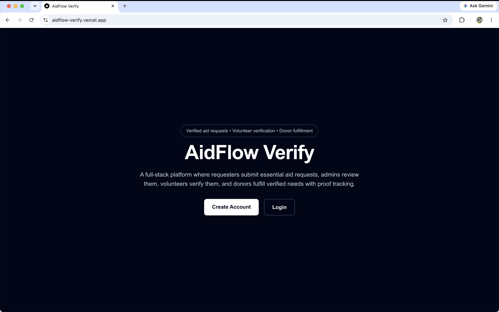
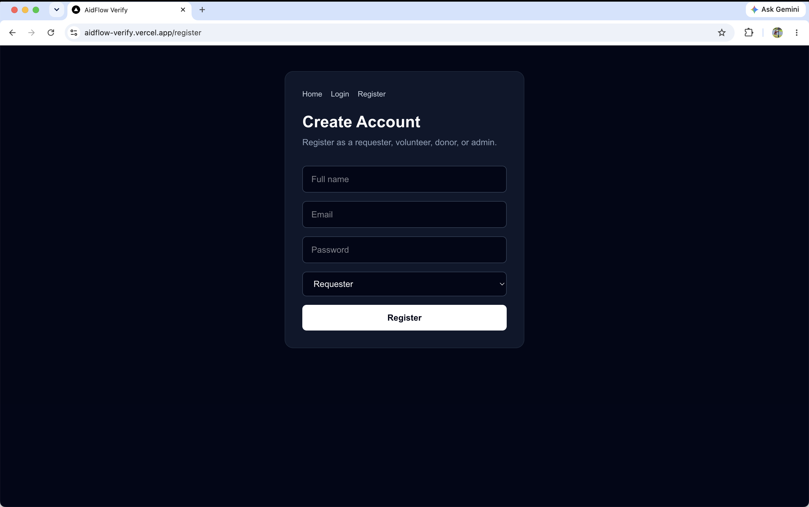
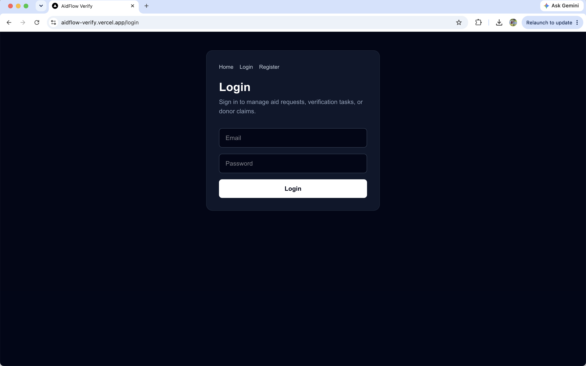
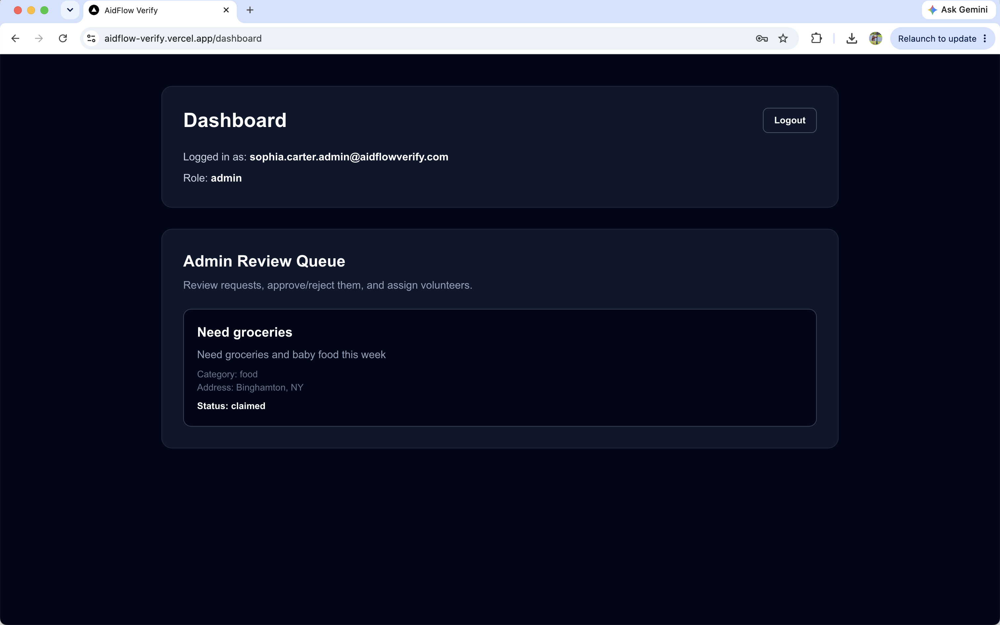
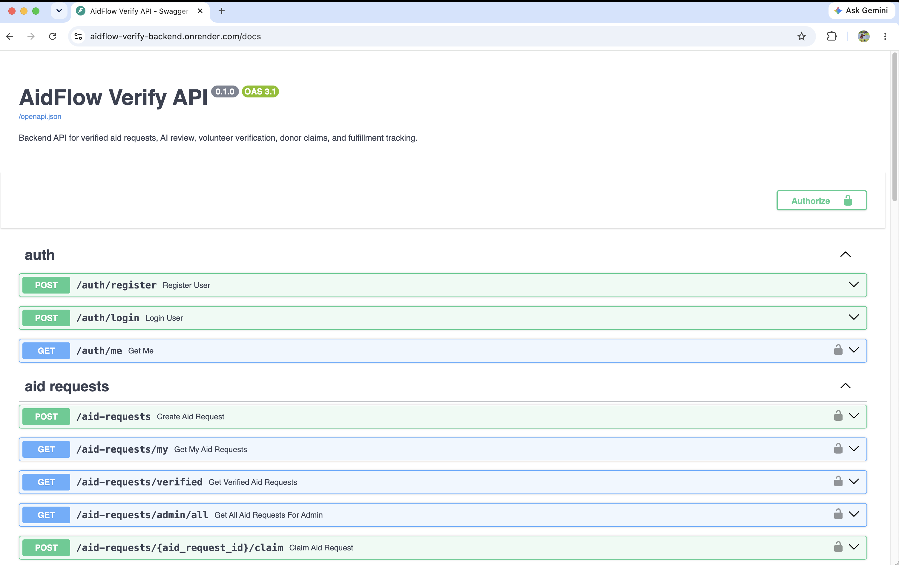

# AidFlow Verify

AidFlow Verify is a deployed full-stack verified aid request platform where requesters submit essential aid requests, admins review them, volunteers verify them, and donors claim verified requests. The platform tracks the request lifecycle using role-based access control, AI-assisted review, PostGIS volunteer matching, proof tracking, and audit logs.

## Live Demo and API Documentation

- Frontend: https://aidflow-verify.vercel.app
- Backend API: https://aidflow-verify-backend.onrender.com
- Swagger API Docs: https://aidflow-verify-backend.onrender.com/docs

Note: The backend is deployed on Render free tier, so the first request may take a few seconds while the service wakes up.

## Screenshots

### Homepage

### Register Page

### Login Page

### Admin Dashboard

### Swagger API Docs

## Project Overview

AidFlow Verify supports an end-to-end aid verification workflow:

1. Requester submits an aid request.
2. Admin reviews the request.
3. Admin can trigger AI-assisted review.
4. Admin approves or rejects the request.
5. Admin assigns a nearby volunteer.
6. Volunteer verifies or rejects the request.
7. Donor browses verified requests.
8. Donor claims a request.
9. Donor submits proof.
10. Admin marks the request as fulfilled.

The project demonstrates API design, database modeling, authentication, RBAC, workflow validation, geospatial queries, testing, CI/CD, Docker, and cloud deployment.

## Tech Stack

### Frontend

- Next.js
- TypeScript
- Tailwind CSS

### Backend

- Python
- FastAPI
- SQLAlchemy
- Alembic
- JWT authentication
- bcrypt password hashing

### Database

- PostgreSQL
- PostGIS
- Neon PostgreSQL

### Testing and DevOps

- pytest
- httpx
- Docker
- Docker Compose
- GitHub Actions

### Deployment

- Vercel frontend
- Render backend
- Neon PostgreSQL database

## Core Features

### Authentication and Authorization

- User registration and login
- JWT-based authentication
- Password hashing with bcrypt
- Role-based access control for requester, admin, volunteer, and donor roles

### Requester Workflow

- Requesters can create aid requests.
- Requesters can view their submitted requests.
- Requests include title, description, category, address, latitude, and longitude.

### Admin Workflow

- Admins can view all aid requests.
- Admins can approve or reject requests.
- Admins can trigger AI-assisted review.
- Admins can find nearby volunteers using PostGIS.
- Admins can assign volunteers to approved requests.
- Admins can mark claimed requests as fulfilled after proof submission.

### Volunteer Workflow

- Volunteers can view assigned verification tasks.
- Volunteers can verify or reject assigned aid requests.
- Verification updates the request status.

### Donor Workflow

- Donors can browse only verified aid requests.
- Donors can claim verified requests.
- Double-claiming is prevented.
- Donors can submit proof for requests they claimed.

### Audit Logging

- Major workflow actions are stored in audit logs.
- Audit logs include actor, action, old status, new status, notes, and timestamp.
- Logged actions include approval, rejection, assignment, verification, claim, proof submission, and fulfillment.

## Request Lifecycle

Successful lifecycle:

submitted → ai_reviewed → admin_approved → assigned_to_volunteer → verified → claimed → fulfilled

Rejection paths:

submitted → admin_rejected

assigned_to_volunteer → verification_rejected

The backend prevents invalid operations such as double claims, donor proof submission by the wrong user, volunteer verification by unauthorized users, and fulfillment without proof.

## AI-Assisted Review

Admins can trigger AI-assisted review for aid requests.

The AI review structures request information into:

- Summary
- Urgency
- Missing fields
- Risk indicators
- Volunteer verification checklist

For the MVP, AI review output is stored directly in the aid_requests table instead of a separate ai_reviews table. This kept the workflow simple while still making AI output visible and reviewable.

## PostGIS Volunteer Matching

AidFlow Verify uses PostgreSQL with PostGIS for nearby volunteer matching.

Requester and volunteer locations are stored using latitude and longitude. Admins can search for nearby volunteers, and the backend returns volunteers sorted by distance.

PostGIS was used because volunteer assignment depends on geographic proximity, not just standard relational filtering.

## Architecture

Local and application architecture:

Next.js Frontend  
→ REST API calls  
→ FastAPI Backend  
→ SQLAlchemy ORM and Alembic migrations  
→ PostgreSQL and PostGIS Database

Production deployment architecture:

Vercel Frontend  
→ Render FastAPI Backend  
→ Neon PostgreSQL and PostGIS Database

## Engineering Decisions and Trade-offs

### FastAPI

FastAPI was chosen for REST API development, request validation, dependency injection, and automatic Swagger documentation.

### Next.js and TypeScript

Next.js with TypeScript was used to build a typed frontend with clean routing and a simple deployment path through Vercel.

### PostgreSQL and PostGIS

PostgreSQL handled relational data, while PostGIS enabled distance-based volunteer matching.

### SQLAlchemy and Alembic

SQLAlchemy was used for ORM-based database models, and Alembic was used for version-controlled database migrations.

### JWT, bcrypt, and RBAC

JWT supports stateless authentication, bcrypt protects stored passwords, and RBAC separates permissions across requester, admin, volunteer, and donor workflows.

### AI Review Storage

AI review output was stored in the aid_requests table for MVP simplicity. A separate ai_reviews table could be added later for version history.

## Testing

Backend tests were added with pytest and httpx.

Tests cover:

- Health endpoint
- User registration and login
- RBAC permission checks
- Aid request workflow
- AI review mock behavior
- PostGIS nearby volunteer matching

## Docker and Local Development

Start backend and database:

docker compose up --build

Backend runs at:

http://localhost:8000

Swagger docs:

http://localhost:8000/docs

Start frontend:

cd frontend  
npm install  
npm run dev

Frontend runs at:

http://localhost:3000

## Environment Variables

Backend:

DATABASE_URL=  
SECRET_KEY=  
ALGORITHM=HS256  
ACCESS_TOKEN_EXPIRE_MINUTES=30

Frontend:

NEXT_PUBLIC_API_BASE_URL=

## CI/CD and Deployment

GitHub Actions runs backend tests automatically.

The production app is deployed with:

- Vercel for frontend
- Render for backend
- Neon for PostgreSQL/PostGIS database

## Production Deployment Notes

During deployment, I configured CORS for the Vercel frontend, updated Alembic to use environment-based database URLs, enabled PostGIS on Neon, and accounted for Render free-tier cold starts.

## Lessons Learned

This project reinforced the importance of modeling workflow state transitions carefully instead of building only basic CRUD APIs. It also showed how authentication, authorization, migrations, tests, Docker, CI/CD, and audit logs improve maintainability, reliability, and production readiness.

## Future Improvements

- Add pagination, filtering, and search for admin, donor, and volunteer dashboards
- Add lightweight AI evaluation and prompt-version tracking for AI-assisted request review
- Add cloud-backed proof file uploads using Supabase Storage, Cloudinary, or similar storage
- Add production monitoring with Sentry or similar error tracking
- Add API safeguards such as rate limiting, stricter validation, and improved error handling

## Final Status

AidFlow Verify is fully deployed and supports the complete verified aid request lifecycle from request creation to volunteer verification, donor claim, proof submission, and fulfillment tracking.